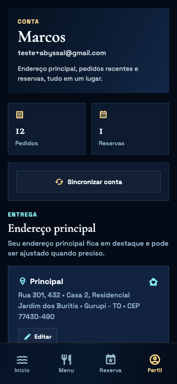
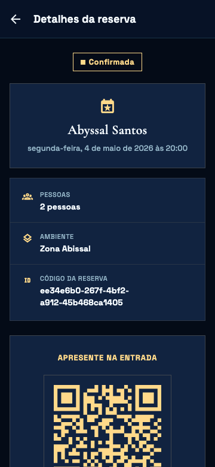

# Abyssal App

Monorepo do restaurante Abyssal com backend FastAPI + SQLAlchemy e app mobile React Native + Expo.

## Estado atual

O projeto hoje está organizado em duas frentes principais:

- [packages/backend](packages/backend) expõe a API REST, o seed inicial, a documentação Swagger e os fluxos de autenticação, catálogo e operações.
- [packages/mobile](packages/mobile) entrega o app Expo com navegação autenticada, home, menu, prato, carrinho, checkout delivery, reservas, detalhes da reserva, acompanhamento de pedido e perfil.

### O que já está implementado

- autenticação com login e cadastro;
- perfil com endereço principal salvo na API;
- home com filiais, destaques e próxima mesa;
- menu com categorias, itens em destaque e carrinho flutuante;
- detalhes de prato;
- carrinho e finalização de delivery;
- reservas presenciais e tela de detalhes da reserva com QR code;
- acompanhamento de pedidos;
- backend com seed inicial, healthcheck e OpenAPI.

## Stack

- Node.js 20+
- Python 3.12+
- Expo SDK 54
- React Native 0.81
- FastAPI
- SQLAlchemy
- PostgreSQL

## Backend

A API está disponível em `http://localhost:3334` no desenvolvimento local. Os principais grupos de rotas são:

- `/api/auth`: login, cadastro, perfil e endereço principal;
- `/api/branches` e `/api/menu`: catálogo de filiais e cardápio;
- `/api/reservations` e `/api/orders`: reservas e pedidos;
- `/health`, `/docs` e `/openapi.json`: healthcheck e documentação.

O backend usa JWT Bearer para rotas protegidas, faz seed automático no bootstrap e mantém a configuração de CORS voltada para ambiente local por padrão. Mais detalhes estão em [packages/backend/README.md](packages/backend/README.md).

## Mobile

O app mobile usa uma navegação em stack com tabs principais para `Inicio`, `Menu`, `Reserva` e `Perfil`. Quando autenticado, o usuário também acessa telas de detalhe do prato, carrinho, checkout delivery, detalhes da reserva e acompanhamento de pedido. A interface atual usa fontes serifadas e sans dedicadas, fundo escuro e cards contrastados para reforçar a identidade visual do Abyssal.

## Configuração local

Copie os arquivos de ambiente:

```bash
cp packages/backend/.env.example packages/backend/.env
cp packages/mobile/.env.example packages/mobile/.env
```

Se estiver testando em Android, iOS ou dispositivo físico, ajuste `EXPO_PUBLIC_API_BASE_URL` para um host alcançável no seu ambiente. Em web, o app normaliza URLs locais de desenvolvimento para a API automaticamente.

## Como executar

Instale as dependências na raiz:

```bash
npm install
```

Suba backend e app mobile no fluxo padrão:

```bash
npm run dev
```

Abra o app no navegador:

```bash
npm run dev:web
```

Rode apenas o backend:

```bash
npm run dev:backend
```

Rode apenas o app mobile:

```bash
npm run dev:mobile
```

Rode apenas o app mobile em web:

```bash
npm run dev:mobile:web
```

Build e testes do backend:

```bash
npm run build:backend
npm run test:backend
```

Builds do mobile:

```bash
npm run build:android:debug
npm run build:android:release
npm run build:android:store
npm run build:ios:debug
npm run build:ios:release
npm run build:ios:store
npm run build:mobile
npm run build:mobile:store
```

Os comandos Android usam `expo run:android`; os de iOS usam `expo run:ios` e exigem Xcode. Os comandos de store chamam o EAS Build com o perfil `production` definido em [packages/mobile/eas.json](packages/mobile/eas.json).

## Capturas

### Autenticação e home


### Menu, reserva e carrinho


### Perfil e detalhe da reserva





## Segurança

- PII sensível fica criptografada em repouso.
- A API aplica CORS diretamente.
- CORS e o bypass de URL local ficam ativos apenas em desenvolvimento.
- Em produção, mantenha `REQUIRE_HTTPS_IN_PRODUCTION=true`, use `EXPO_PUBLIC_API_BASE_URL` com HTTPS, defina `CORS_ALLOW_LOCALHOST=false` e restrinja `CORS_ALLOWED_ORIGINS` para a origem exata do frontend.
